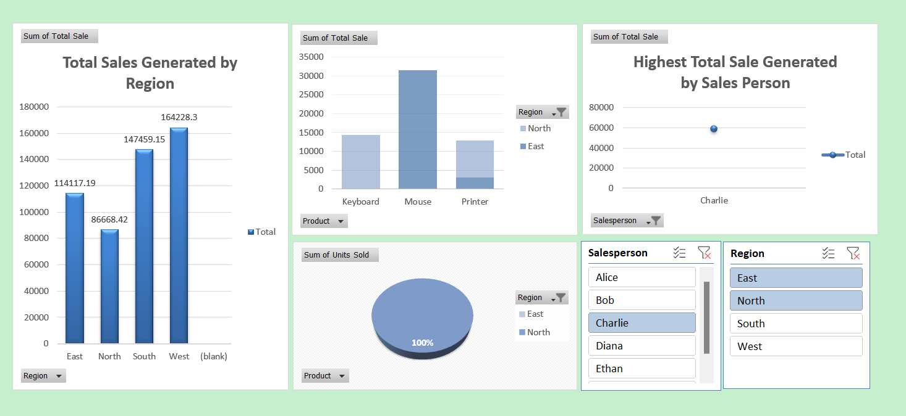

# 📊 Sales Dashboard

## 📌 Project Overview

The **Sales Dashboard** is an interactive Excel dashboard designed to analyze sales performance across different **regions, products, and salespeople**.

The dashboard helps identify top-performing areas, understand product sales trends, and support data-driven business decisions.

---

## 🎯 Objective

To analyze sales performance across **regions, products, and salespeople** using an interactive Excel dashboard, in order to identify top-performing areas and support data-driven sales decisions.

---

## 📈 Key Insights

- **Regional Performance:**  
  West has the highest total sales at approximately **164.2K**, while North has the lowest at approximately **86.7K**.

- **Product-wise Sales:**  
  **Mouse** is the best-performing product in the selected regions, generating approximately **31.5K** in sales.

- **Top Salesperson:**  
  **Charlie** is the highest-performing salesperson in the current dashboard selection, with approximately **60K** in total sales.

- **Growth Opportunity:**  
  The strong performance of **West and South** can be used as a benchmark to improve sales in lower-performing regions.

- **Sales Strategy:**  
  Focusing on high-performing products and replicating successful salesperson and regional strategies can help increase overall revenue.

---

## 🛠️ Tools & Technologies

- Microsoft Excel
- Pivot Tables
- Pivot Charts
- Slicers
- Data Visualization
- Excel Dashboard

---

## 📊 Dashboard Features

- Regional Sales Analysis
- Product-wise Sales Analysis
- Salesperson Performance
- Units Sold Analysis
- Interactive Region Filter
- Interactive Salesperson Filter
- Visual Sales KPIs

---

## 🖼️ Dashboard Preview

---

## 📁 Project Files

| File | Description |
|------|-------------|
| `Sales Dashboard.xlsx` | Interactive Excel dashboard |
| `Sales_Dashboard_Project_INsigts.png` | Dashboard/project insights image |
| `README.md` | Project documentation |

---

## 💡 Business Value

This dashboard provides a quick and interactive way to understand sales performance and identify **high-performing regions, products, and salespeople**, helping management make better sales and marketing decisions.

---

## 👤 Author

**Disha Manje**

📌 Data Analytics / Excel Dashboard Project
